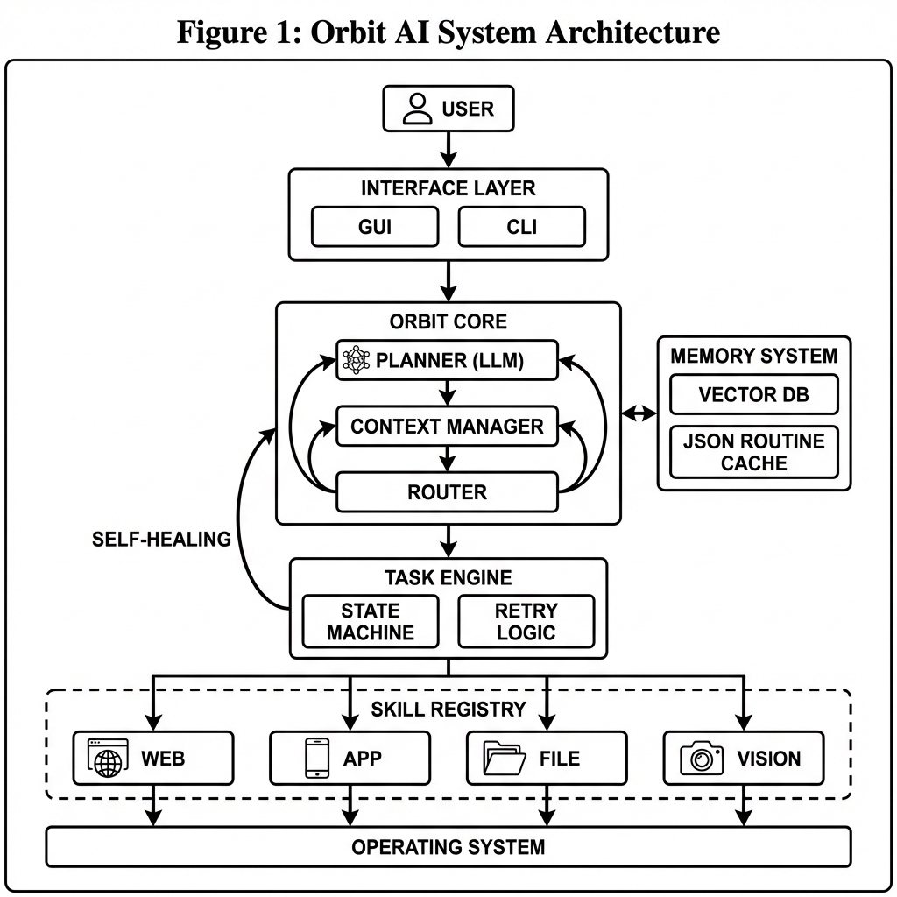

# Orbit Agent (v0.9.0 - Self-Aware)

**Autonomous Desktop Intelligence.**

Orbit is a local-first AI agent designed to operate your computer with the same dexterity and reasoning as a human user. It integrates Vision (GPT-4V), Planning (Chain-of-Thought), and precise Tooling to execute complex workflows—from coding entire applications to rapid web research—while keeping you in the loop.

> "A Junior Engineer with Senior Guardrails."

---

## Core Capabilities

### 1. The Architect Protocol (Coding)
Orbit does not just write code; it follows a strict software engineering lifecycle:
1.  **Isolate:** Creates a clean project folder in `~/orbit_workspace/`.
2.  **Design:** Drafts `task.md` (Plan) and `architecture.md` (System Design).
3.  **Consult:** **Pauses** execution to request your approval ("Proceed").
4.  **Implement:** Writes the actual code file-by-file only after the design is approved.

### 2. Universal Computer Control (New!)
Unlike simple chatbots, Orbit has hands.
-   **Desktop Control:** Uses computer vision and OS hooks to click, type, drag, and scroll anywhere on your screen.
-   **Visual Awareness:** Can verify if an action succeeded by "looking" at the screen (e.g., hovering over a button and verifying the tooltip).
-   **Feedback Loop:** "Click -> Look -> Correction." If it misses a button, it detects the failure and retries.

### 3. Digital Nomad Skills
-   **Web Surfing:** Uses a headless browser (Playwright) to search DuckDuckGo, visit pages, and extract content without CAPTCHA blocks.
-   **App Control:** "Open Spotify", "Close Calculator". Manages local windows natively.

### 4. Active Intelligence
-   **Self-Healing:** If a tool fails (e.g. "File not found"), Orbit detects the error, re-plans, and executes recovery steps autonomously.
-   **Muscle Memory:** Learns from successful tasks. If you ask it to do something it has done before, it retrieves the optimized routine, skipping the planning phase.
-   **Privacy First:** All configuration and keys are stored locally in `.env` (never committed).

---

## Installation

**Prerequisites:** Python 3.10+

```bash
# 1. Clone
git clone https://github.com/Start-Orbit/orbit.git
cd orbit

# 2. Install Dependencies
pip install -r requirements.txt
pip install PyQt6 qasync playwright mss pyautogui python-dotenv
playwright install

# 3. Setup Secrets
# Create a .env file based on the example
cp .env.example .env
# Edit .env and add your OPENAI_API_KEY
```

---

## Usage

### 1. The Desktop Companion (GUI)
The primary interface. A sleek, unobtrusive "Glass Card" widget.

```bash
python -m orbit_agent.gui.main
```

-   **Chat:** "Who are you?"
-   **Tasks:** "Create a Snake Game in Python." (Triggers Architect Protocol)
-   **Vision:** Click the visible Eye Icon to analyze your screen.
-   **Control:** "Open Notepad and type 'Hello World'."
-   **Self-Check:** "Close yourself."

### 2. The Ghost Shell (CLI)
Low-latency command line interface.

```bash
python -m orbit_agent.cli.main chat
```

---

## Configuration

Orbit looks for `.env` for secrets and `orbit_config.yaml` for preferences.

```yaml
# orbit_config.yaml

# Set to 'false' to allow fully autonomous execution (no "Allow?" popups)
safe_mode: false 

  provider: "openai" # Options: openai, deepseek, xai (grok), local (ollama)
  model_name: "gpt-4-turbo" # or "grok-beta", "deepseek-chat"
  api_key_env_var: "OPENAI_API_KEY"
  # base_url: "https://api.x.ai/v1" # Uncomment for Grok
  # base_url: "http://localhost:11434/v1" # Uncomment for Ollama/Local
```

---

## Cost & Efficiency

-   **High Efficiency:** Orbit uses a "Planning" architecture. It pays for thinking once, then executes 10-20 steps (coding, file ops) for free using local Python code.
-   **Heavy Usage:** **Vision** features (Screen Analysis) send screenshots to GPT-5.1. This is token-heavy (~1k tokens per look).
    -   *Recommendation:* Use the CLI/Chat for coding tasks. Use the GUI Vision features for specific, high-value visual problems until we release **Local Vision** support.

---

## System Architecture



-   **Core:** `orbit_agent.core` (Agent Loop, Planner, Router)
-   **Skills:** `orbit_agent.skills` (Vision, Desktop, Browser, file I/O)
-   **GUI:** `orbit_agent.gui` (PyQt6 Asynchronous)
-   **Memory:** Ephemeral (RAM) + Persistent Routines (`jsonl`).

---

## Work in Progress (WIP)

We are actively working on:
1.  **Precision & Accuracy:** Refining the "click-look-verify" loop for 100% reliable execution on any UI.
2.  **End-to-End Software Building:** Enhancing the Architect Protocol to autonomously design, code, debug, and launch complex full-stack applications.
3.  **Multi-Awareness:** Improving the agent's ability to maintain context across multiple open applications, tabs, and long-running sessions.
4.  **Heavy Testing:** Rigorous stress-testing on diverse real-world workflows to ensure production-grade stability.
5.  **Digital Ubiquity:** Enabling Orbit to "live" continuously across the digital world—traversing local desktops, cloud servers, and diverse environments without losing continuity.
6.  **Orbit Uplink (Mobile Access):** A secure bridge allowing you to chat with your Desktop Agent via WhatsApp/Telegram from anywhere. Ask "How's the render?" and receive a screenshot analysis in real-time.

---

## License
Apache 2.0 - See `LICENSE` for details.

*Built by NVDY.*
